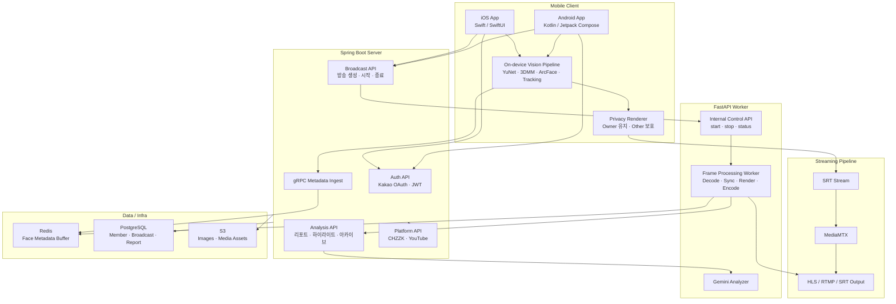
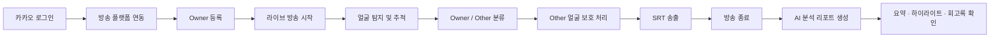
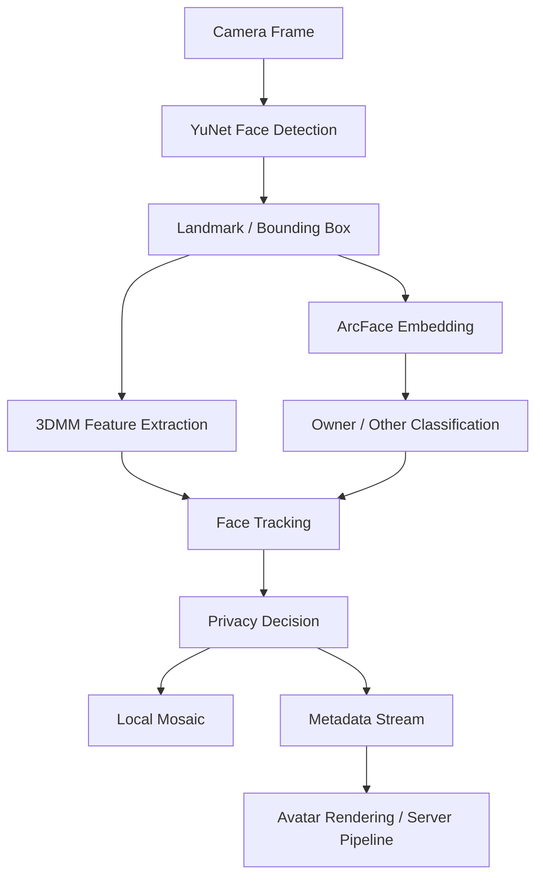
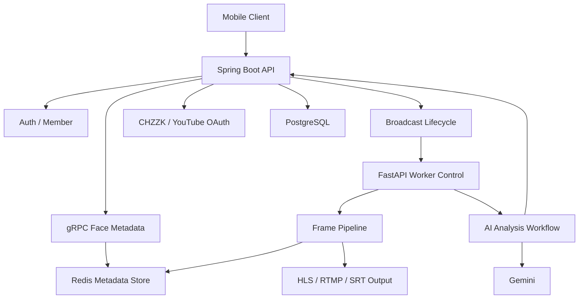

# FOCUS

> 소개 페이지: https://kookmin-sw.github.io/2026-capstone-17/

# 일반 캡스톤 17조: FOCUS

**FOCUS**는 라이브 스트리밍 중 화면에 우연히 등장하는 비대상 인물의 얼굴을 실시간으로 보호하고, 방송 종료 후에는 AI 기반 회고 리포트까지 제공하는 스트리밍 프라이버시 보호 서비스입니다.

스트리머는 방송의 몰입감과 현장감을 유지하면서도 주변 인물의 초상권 노출 위험을 줄일 수 있습니다. FOCUS는 모바일 클라이언트의 온디바이스 비전 처리, Spring Boot 기반 서버, FastAPI 영상 워커, Redis 메타데이터 파이프라인, AI 분석 리포트 기능을 하나의 방송 흐름으로 연결합니다.

---

## 서비스 소개

라이브 방송에서는 의도하지 않은 인물이 화면에 노출되는 상황이 자주 발생합니다. 특히 야외 방송, 행사장 방송, 합방 환경에서는 방송자가 화면 전체를 통제하기 어렵고, 송출된 영상은 이후 되돌리기 어렵습니다.

FOCUS는 이 문제를 해결하기 위해 **스트리머와 주변 인물을 구분**하고, 보호 대상 얼굴에만 모자이크 또는 아바타 기반 보호 처리를 적용합니다. 방송 중에는 실시간 보호에 집중하고, 방송 종료 후에는 보호 처리 현황과 방송 내용을 AI가 요약해 회고 리포트로 제공합니다.

## 핵심 기능

| 기능 | 설명 |
| --- | --- |
| Owner 등록 | 방송자가 프리뷰 화면에서 자신을 Owner로 등록하고 관리합니다. |
| 실시간 얼굴 탐지 | YuNet, OpenCV, 3DMM, ArcFace 기반으로 얼굴 위치와 특징을 추출합니다. |
| Owner / Other 분류 | 등록된 Owner와 비대상 인물을 구분해 보호 대상을 결정합니다. |
| 선택적 프라이버시 보호 | 스트리머는 유지하고 Other 얼굴에만 모자이크 또는 아바타 보호를 적용합니다. |
| 메타데이터 스트리밍 | 얼굴 좌표, 추적 ID, 타임스탬프 등 구조화 데이터를 gRPC/Redis 흐름으로 전달합니다. |
| 라이브 송출 연동 | SRT 기반 스트리밍과 MediaMTX 중심 방송 파이프라인을 고려합니다. |
| 방송 분석 리포트 | 방송 종료 후 Gemini 기반 요약, 하이라이트 후보, 보호 지표, 개선 팁을 제공합니다. |
| 회고록 아카이브 | 이전 방송 리포트를 날짜별로 확인하고 상세 리포트로 다시 볼 수 있습니다. |

## 팀 소개

<table>
  <tr>
    <td align="center" width="160">
      <b>이지상</b><br />
      <sub>팀장 · AOS 개발</sub>
    </td>
    <td align="center" width="160">
      <b>이동언</b><br />
      <sub>iOS 개발</sub>
    </td>
    <td align="center" width="160">
      <b>이제준</b><br />
      <sub>FastAPI</sub>
    </td>
    <td align="center" width="160">
      <b>민승호</b><br />
      <sub>Spring</sub>
    </td>
    <td align="center" width="160">
      <b>신윤솔</b><br />
      <sub>OpenCV</sub>
    </td>
  </tr>
</table>

---

## Architecture Overview



## User Flow



## AI / Vision Pipeline



## Backend Flow



## Tech Stack

| Layer | Technology |
| --- | --- |
| iOS | Swift, SwiftUI, AVFoundation, CocoaPods |
| Android | Kotlin, Jetpack Compose, Hilt, Android Gradle Plugin |
| AI / Vision | OpenCV YuNet, TensorFlow Lite, ONNX Runtime, ArcFace, 3DMM |
| Streaming | SRT, MediaMTX, FFmpeg, HLS |
| Backend | Kotlin, Spring Boot, Spring Security, Spring Data JPA, Spring gRPC |
| Internal Worker | Python, FastAPI, PyAV, FFmpeg subprocess pipeline |
| Database / Cache | PostgreSQL, Redis |
| Storage | AWS S3 |
| Auth / Platform | Kakao OAuth, CHZZK API, YouTube API, JWT |
| AI Analysis | Gemini API |
| Infra | Docker, Docker Compose, EC2 deployment scripts |

## 주요 모듈 설명

### Mobile Client

iOS와 Android 앱은 방송자의 실제 사용 경험을 담당합니다. 카카오 로그인, 방송 플랫폼 연결, Owner 등록, 실시간 카메라 프리뷰, 얼굴 탐지 결과 시각화, 방송 후 리포트 화면을 제공합니다.

### On-device Vision

모바일 단에서 얼굴 탐지와 분류를 수행합니다. 얼굴 위치를 찾고, Owner 등록 데이터와 비교해 방송자와 주변 인물을 구분합니다. 민감한 실시간 판단은 가능한 한 로컬에서 처리하는 방향입니다.

### Spring Boot Server

외부 클라이언트가 접근하는 핵심 API 서버입니다. 인증, 회원 정보, 방송 생성/시작/종료, 방송 플랫폼 연동, gRPC 메타데이터 수신, 방송 분석 결과 조회, 리포트 저장을 담당합니다.

### FastAPI Worker

Spring Boot가 제어하는 내부 영상 처리 워커입니다. 방송 시작/중지 명령을 받고 MediaMTX 입력 스트림을 프레임 단위로 처리합니다. Redis에서 얼굴 메타데이터를 읽어 영상 처리 파이프라인에 동기화하고, 방송 종료 후 분석 작업과도 연결됩니다.

### Analysis Report

방송 종료 후 보호 처리 지표, 하이라이트 후보, 시청자 피크 인사이트, 콘텐츠 비율, 다음 방송 개선 팁 등을 AI가 요약합니다. 사용자는 요약 리포트와 상세 리포트를 통해 방송 품질과 보호 상황을 회고할 수 있습니다.

## Project Structure

```text
2026-capstone-17/
├── README.md
├── index.html                         # GitHub Pages 소개 페이지
├── index.md
├── _config.yml
│
├── focus-ios/                         # iOS 클라이언트
│   ├── focus.xcodeproj/
│   ├── focus.xcworkspace/
│   ├── Podfile
│   ├── FocusApp-Info.plist
│   ├── analysis/
│   │   └── test_chzzk_srt_stream.sh
│   ├── design-system/
│   ├── focus/
│   │   ├── app/                       # SwiftUI 앱 진입 및 화면 구성
│   │   ├── auth/                      # 카카오 로그인 및 인증 흐름
│   │   ├── broadcast/                 # 방송 생성, 상태, 리포트 연동
│   │   ├── capture/                   # 카메라/오디오 캡처
│   │   ├── detection/                 # 얼굴 감지
│   │   ├── inference/                 # TFLite / ONNX 추론
│   │   ├── metadata/                  # JSON / gRPC 메타데이터
│   │   ├── pipeline/                  # 실시간 프레임 처리 파이프라인
│   │   ├── render/                    # 모자이크/프리뷰 렌더링
│   │   ├── streaming/                 # SRT 송출 및 로컬 녹화
│   │   ├── tracking/                  # 얼굴 추적 및 ID 유지
│   │   └── storage/                   # 세션 산출물 저장
│   ├── focusTests/
│   └── focusUITests/
│
├── android/
│   ├── README.md
│   └── FocusAndroid/                  # Android 클라이언트
│       ├── app/                       # 앱 진입점 및 메인 UI
│       ├── core/
│       │   ├── ai/                    # YuNet, 3DMM, ArcFace, 추적 로직
│       │   ├── grpc/                  # 얼굴 메타데이터 gRPC 전송
│       │   ├── media/                 # 미디어 처리 공통 모듈
│       │   ├── metadata/              # 메타데이터 모델/관리
│       │   ├── network/               # API 통신
│       │   ├── streaming/             # 방송 송출 흐름
│       │   └── ui/                    # 공통 UI 컴포넌트
│       ├── feature/
│       │   ├── account/               # 계정 화면
│       │   ├── auth/                  # 로그인
│       │   ├── broadcast/             # 방송 관리
│       │   ├── camera/                # 카메라 화면
│       │   └── video/                 # 영상 처리 기능
│       ├── build.gradle.kts
│       └── settings.gradle.kts
│
├── spring/
│   └── focus-server/                  # Spring Boot 백엔드
│       ├── build.gradle.kts
│       ├── docker-compose.yaml
│       ├── docker-compose.local-db.yaml
│       ├── Dockerfile
│       ├── db/
│       │   ├── init.sql
│       │   ├── google-login-migration.sql
│       │   └── youtube-platform-migration.sql
│       ├── docs/
│       │   ├── DEPLOYMENT_AND_CLIENT_GUIDE.md
│       │   ├── gemini-analysis-integration.md
│       │   ├── grpc-face-metadata-api.md
│       │   ├── grpc-server-local-runbook.md
│       │   ├── local-e2e-runbook.md
│       │   └── youtube-platform-integration.md
│       ├── scripts/
│       │   ├── ec2-health-watchdog.sh
│       │   ├── install-ec2-watchdog.sh
│       │   └── local_dev_jwt.py
│       └── src/main/
│           ├── kotlin/com/capstone/focus/
│           │   ├── api/
│           │   │   ├── analysis/       # 방송 분석 및 AI 리포트
│           │   │   ├── broadcast/      # 방송 생명주기 관리
│           │   │   ├── grpc/           # 얼굴 메타데이터 수신
│           │   │   ├── image/          # 사용자 이미지 관리
│           │   │   └── platform/       # CHZZK / YouTube 연동
│           │   ├── auth/               # OAuth, JWT, Security
│           │   ├── common/             # 설정, 예외, 외부 클라이언트
│           │   └── domain/             # Entity, Repository, Domain Service
│           ├── proto/focus/metadata/v1/
│           │   └── face_metadata.proto
│           └── resources/
│               ├── application.yaml
│               └── application-prod.yaml
│
├── fast-api-server/                   # 내부 영상 처리 및 분석 워커
│   ├── README.md
│   ├── Dockerfile
│   ├── docker-compose.yaml
│   ├── deploy/
│   │   └── docker-compose.ec2.yaml
│   ├── api/
│   │   ├── routes_health.py           # 헬스 체크
│   │   ├── routes_stream.py           # 스트림 시작/중지/상태 API
│   │   └── exception_handlers.py
│   ├── adapters/
│   │   ├── frame_sink.py              # 출력 프레임 처리
│   │   ├── media_source.py            # 입력 스트림 처리
│   │   └── metadata_store.py          # Redis 메타데이터 접근
│   ├── core/
│   │   ├── config.py
│   │   ├── exceptions.py
│   │   └── logging.py
│   ├── model/
│   │   └── renderer.py                # 아바타 렌더러 인터페이스
│   ├── schemas/
│   │   ├── analysis.py
│   │   ├── common.py
│   │   └── stream.py
│   ├── services/
│   │   ├── analysis_archive.py
│   │   ├── analysis_workflow.py
│   │   ├── gemini_analyzer.py
│   │   ├── s3_storage.py
│   │   ├── spring_analysis_client.py
│   │   └── stream_manager.py
│   ├── workers/
│   │   ├── pipeline.py                # 프레임 디코딩/동기화/렌더링/인코딩
│   │   └── types.py
│   ├── requirements.txt
│   └── requirements.media.txt
│
└── focus-avatar/                      # 아바타 관련 실험/리소스
    ├── README.md
    ├── logs/
    └── project/
```

## 데이터 흐름 요약

1. 사용자가 모바일 앱에서 로그인하고 방송 플랫폼을 연결합니다.
2. 방송자는 프리뷰에서 Owner를 등록합니다.
3. 앱은 카메라 프레임에서 얼굴을 탐지하고 Owner / Other를 분류합니다.
4. Other 얼굴은 실시간으로 보호 처리됩니다.
5. 얼굴 좌표, 추적 ID, 타임스탬프 등 메타데이터는 gRPC를 통해 서버로 전달됩니다.
6. Spring Boot 서버는 메타데이터를 Redis에 저장하고 방송 상태를 관리합니다.
7. FastAPI 워커는 영상 스트림과 메타데이터를 동기화해 후처리 또는 출력 파이프라인을 수행합니다.
8. 방송 종료 후 AI 분석 리포트가 생성되고, 사용자는 요약/상세 리포트와 회고록을 확인합니다.

## 기대 효과

- 라이브 방송 중 비대상 인물의 초상권 노출 위험 감소
- 화면 전체 블러가 아닌 선택적 보호로 방송 품질 유지
- 모바일 온디바이스 처리 중심으로 민감 데이터 전송 부담 완화
- 방송 종료 후 AI 리포트로 스트리머의 콘텐츠 개선 지원
- Android, iOS, Spring, FastAPI가 결합된 실제 서비스형 캡스톤 구조 확보

---

FOCUS는 **실시간 보호**와 **방송 후 회고**를 함께 제공해, 스트리머가 더 안전하고 품질 높은 라이브 방송을 만들 수 있도록 돕는 것을 목표로 합니다.
