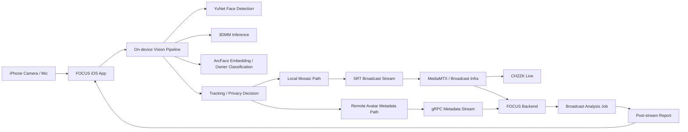

<p align="center">
  
</p>

<p align="center">
  
</p>

<h1 align="center">FOCUS</h1>

<p align="center">
  <b>스트리머는 그대로, 배경 인물은 안전하게 보호하는 AI 기반 라이브 프라이버시 스트리밍 앱</b>
</p>

<p align="center">
  카카오 로그인, 치지직 연동, 실시간 얼굴 감지, 아바타 전환/모자이크 처리, 방송 후 분석 리포트까지 하나의 iOS 앱에서 연결합니다.
</p>

---

## 📚 목차

- [1. 프로젝트 소개](#1-프로젝트-소개)
  - [프로젝트 개요](#프로젝트-개요)
  - [핵심 가치](#핵심-가치)
  - [핵심 기능](#핵심-기능)
- [2. 사용자 흐름](#2-사용자-흐름)
- [3. 기술 스택](#3-기술-스택)
- [4. 시스템 아키텍처](#4-시스템-아키텍처)
- [5. 폴더 구조](#5-폴더-구조)
- [6. 실행 방법](#6-실행-방법)

---

# 1. 프로젝트 소개

## 프로젝트 개요

**FOCUS**는 라이브 스트리밍 중 카메라에 우연히 잡히는 비참여자의 얼굴을 보호하기 위해 만든 iOS 앱입니다.

방송 진행자는 카카오 로그인과 치지직 연동만 마치면 바로 방송을 시작할 수 있고, 앱은 온디바이스 얼굴 분석과 추적을 통해 인물 정보를 분리합니다. 이후 상황에 따라 **아바타 기반 보호** 또는 **모자이크 보호**를 적용하고, 방송이 끝난 뒤에는 분석 결과를 요약 리포트로 제공합니다.

## 핵심 가치

- **실시간 프라이버시 보호**: 방송에 의도치 않게 등장한 사람의 얼굴을 자동으로 감지하고 보호합니다.
- **스트리머 중심 경험**: 복잡한 설정 없이 카카오 로그인과 치지직 연동만으로 방송을 시작할 수 있습니다.
- **온디바이스 AI + 서버 연동**: 민감한 실시간 판단은 앱에서 빠르게 처리하고, 방송 분석과 후처리는 서버와 연동합니다.
- **운영 디버깅 가능성**: 메타데이터 전송, 방송 상태, 분석 결과를 앱 내부에서 추적할 수 있어 개발/운영에 유리합니다.

## 핵심 기능

| 기능 | 설명 |
| --- | --- |
| 카카오 로그인 | 카카오 계정 기반으로 앱 진입 및 사용자 인증을 진행합니다. |
| 치지직 채널 연동 | 치지직 채널을 연결하고 방송 준비 상태를 확인합니다. |
| 실시간 얼굴 감지/추적 | YuNet, 3DMM, ArcFace 기반 파이프라인으로 얼굴을 감지하고 추적합니다. |
| 프라이버시 모드 전환 | `아바타`, `블러(모자이크)`, `비활성화` 모드를 상황에 맞게 선택할 수 있습니다. |
| 아바타 방송 메타데이터 전송 | 방송 영상과 별도로 gRPC 메타데이터를 전송해 서버 측 아바타 치환에 활용합니다. |
| SRT 라이브 송출 | HaishinKit 기반으로 방송 영상을 SRT로 송출합니다. |
| 방송 후 분석 리포트 | 방송 종료 후 요약, 하이라이트 후보, 치환 수치 등 분석 결과를 리포트로 제공합니다. |

---

# 2. 사용자 흐름

1. 사용자는 카카오 로그인으로 앱에 진입합니다.
2. 치지직 채널을 연결하고 방송 가능한 상태를 준비합니다.
3. 앱은 카메라/오디오 입력을 받아 얼굴 감지, 추적, 프라이버시 처리를 수행합니다.
4. 선택한 모드에 따라 로컬 모자이크 또는 원격 아바타 치환용 메타데이터를 함께 송출합니다.
5. 방송 종료 후 분석 작업을 조회하고, 결과를 리포트 화면으로 보여줍니다.

---

# 3. 기술 스택

| 분야 | 기술 |
| --- | --- |
| Client | Swift, SwiftUI, AVFoundation |
| Streaming | SRT, HaishinKit, SRTHaishinKit |
| AI Inference | TensorFlow Lite, ONNX Runtime |
| Detection / Vision | OpenCV YuNet, 3DMM 추론, ArcFace 임베딩 |
| Auth / External | Kakao SDK, 치지직 연동 |
| Network | URLSession, gRPC Swift |
| Local Data / Output | JSON metadata, MP4 recording, avatar debug artifacts |
| Tooling | Xcode, CocoaPods |

---

# 4. 시스템 아키텍처



**요약**

- 영상/오디오는 iOS 앱에서 실시간 처리됩니다.
- 얼굴 감지와 프라이버시 판단은 온디바이스 파이프라인이 담당합니다.
- 아바타 모드에서는 영상과 별도로 메타데이터를 보내 서버 측 치환에 활용합니다.
- 방송 종료 후에는 서버 분석 결과를 다시 앱으로 가져와 리포트로 표시합니다.

---

# 5. 폴더 구조

```text
focus/
├── focus/
│   ├── app/          # SwiftUI View / ViewModel
│   ├── capture/      # Camera / audio capture
│   ├── pipeline/     # 실시간 처리 파이프라인
│   ├── detection/    # Face detector service
│   ├── inference/    # TFLite / ONNX inference
│   ├── tracking/     # Face tracking / identity logic
│   ├── render/       # Mosaic / preview / rotation renderer
│   ├── streaming/    # SRT 송출 / 로컬 녹화
│   ├── metadata/     # JSON / gRPC metadata
│   ├── broadcast/    # Broadcast API / models
│   ├── auth/         # Kakao login
│   └── storage/      # Session output files
├── Pods/
├── Vendor/
└── focus.xcworkspace
```

---

# 6. 실행 방법

## 요구 사항

- Xcode
- CocoaPods
- iOS 15 이상

## 설치 및 실행

```bash
pod install
open focus.xcworkspace
```

Xcode에서 `focus` 스킴을 선택한 뒤 실행하면 됩니다.

## 실행 전 확인할 것

- 카카오 로그인 설정이 필요합니다.
- 서버 및 방송 인프라 주소는 [constants.swift](./focus/models/constants.swift) 에 정의되어 있습니다.
- 모델 파일과 원격 API가 준비되어 있어야 전체 기능을 확인할 수 있습니다.

---

FOCUS는 **라이브 스트리밍의 몰입감은 유지하면서도, 함께 잡히는 사람의 프라이버시는 놓치지 않는 경험**을 목표로 개발하고 있습니다.
